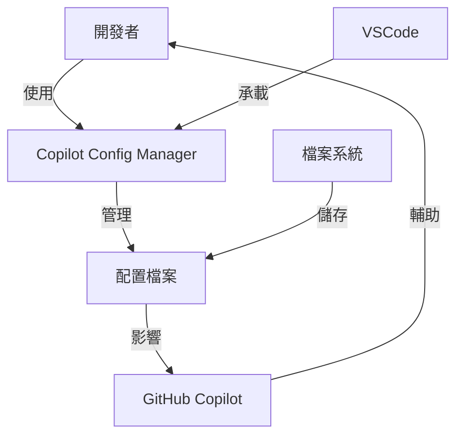
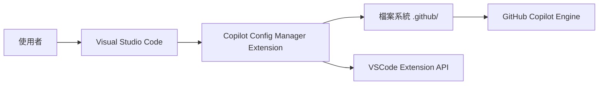
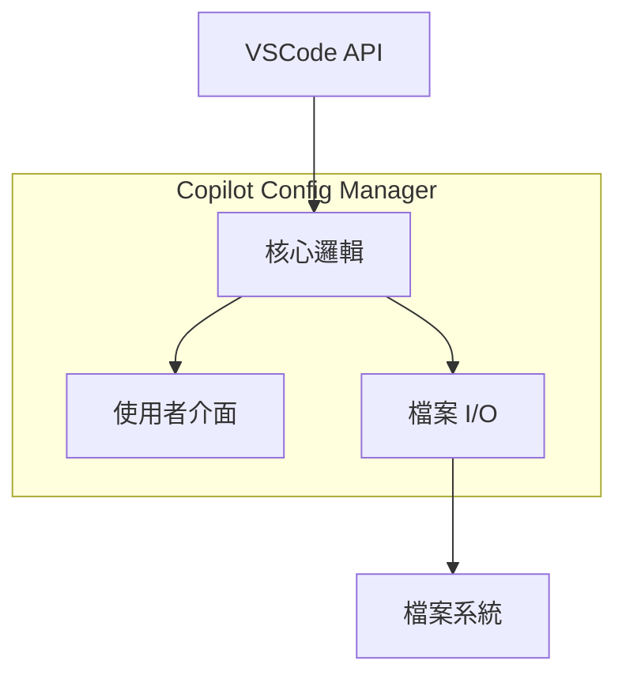
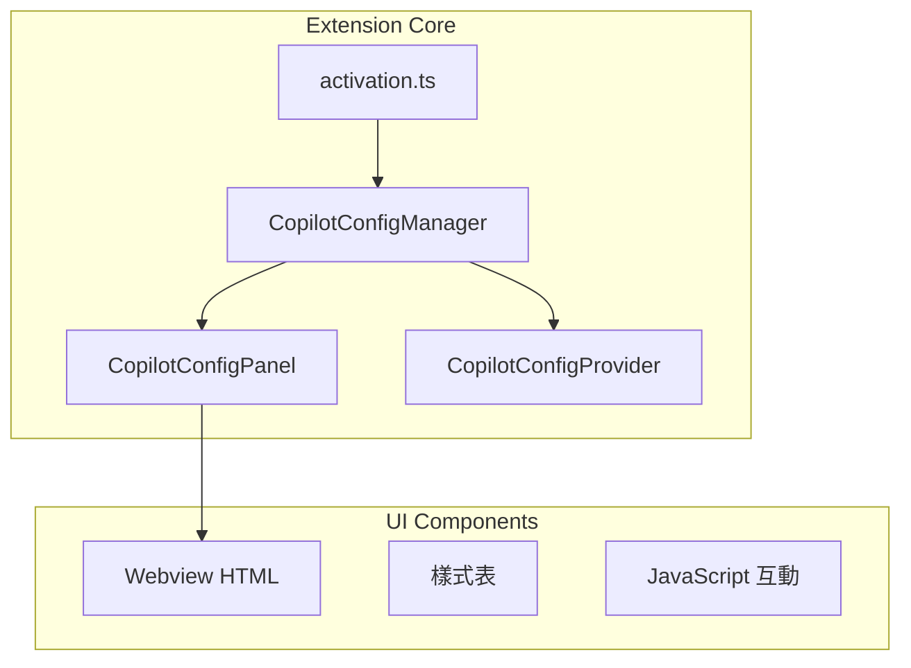
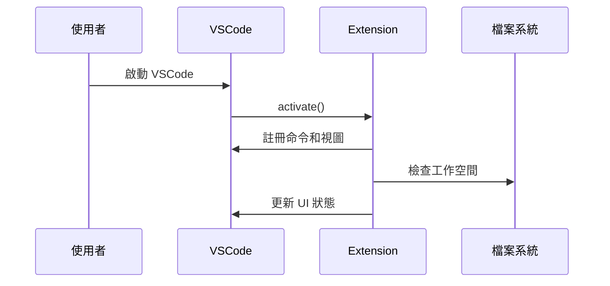
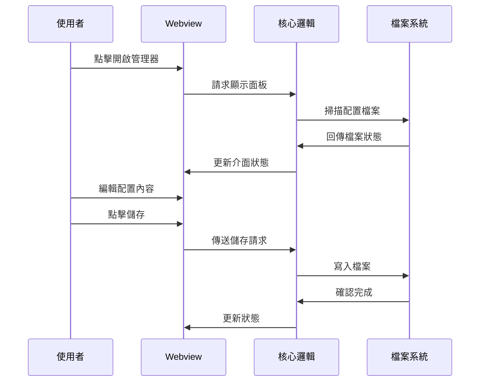
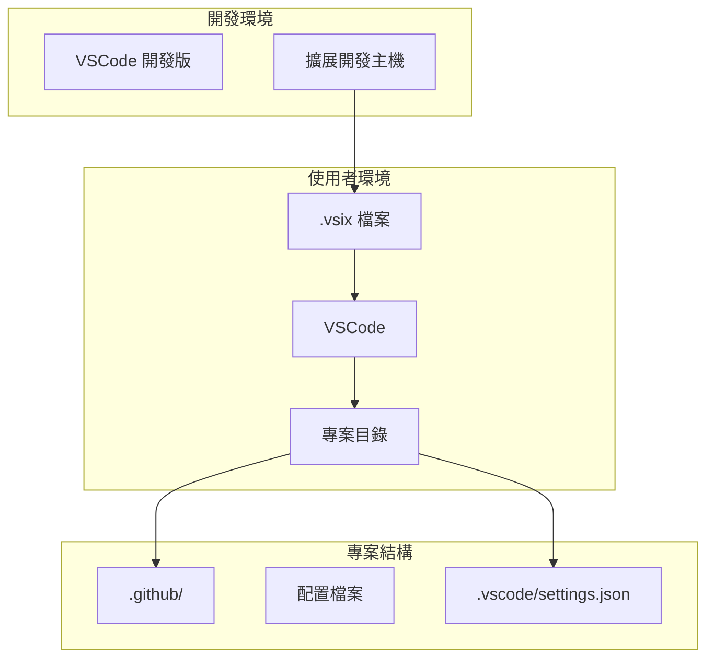

# 🤖 Copilot Config Manager

基於 arc42 架構文件範本的 Visual Studio Code 擴展

## 1. 🎯 簡介與目標

### 1.1 需求概述

Copilot Config Manager 是一個專為 Visual Studio Code 設計的擴展，旨在提供統一的 GitHub Copilot 配置檔案管理介面。該擴展解決了開發者在專案層級管理 AI 輔助程式設定的複雜性，提供直觀的圖形化介面來編輯和管理各種 Copilot 指令檔案。

### 1.2 品質目標

| 優先級 | 品質目標 | 場景描述 |
|--------|----------|----------|
| 1 | **易用性** | 開發者可在 3 分鐘內學會使用所有核心功能 |
| 2 | **安全性** | 僅操作專案範圍內檔案，不影響全域設定 |
| 3 | **可靠性** | 確保檔案操作不會造成資料遺失或設定損壞 |
| 4 | **效能** | 介面響應時間 < 500ms，檔案載入 < 1s |
| 5 | **擴展性** | 支援未來新增更多 Copilot 配置檔案類型 |

### 1.3 利害關係人

| 角色 | 接觸點 | 期望 |
|------|-------|------|
| **終端使用者** | VSCode 介面 | 簡單直觀的配置管理體驗 |
| **專案維護者** | 程式碼審查 | 穩定可靠的程式碼品質 |
| **DevOps 工程師** | 部署流程 | 無衝突的安裝和更新機制 |

## 2. ⚙️ 架構約束

### 2.1 技術約束

| 約束 | 背景和動機 |
|------|------------|
| **VSCode API ^1.74.0** | 最低支援版本，確保 API 相容性 |
| **TypeScript 4.9+** | 型別安全和現代 JavaScript 特性 |
| **Node.js 16+** | 執行環境需求 |
| **Webview API** | 使用者介面實作限制 |

### 2.2 組織約束

| 約束 | 背景和動機 |
|------|------------|
| **MIT 授權** | 開源專案授權要求 |
| **單一開發者維護** | 資源限制 |
| **無外部服務依賴** | 隱私和離線使用考量 |

### 2.3 慣例

- 繁體中文為主要介面語言
- 遵循 VSCode 擴展開發最佳實務
- 採用 arc42 文件架構

## 3. 🌐 系統範疇與環境

### 3.1 業務環境



**外部實體：**
- **開發者**: 主要使用者，透過 VSCode 操作擴展
- **GitHub Copilot**: 讀取配置檔案的 AI 系統
- **專案檔案系統**: 儲存配置檔案的位置

### 3.2 技術環境



## 4. 💡 解決方案策略

### 4.1 技術決策

| 決策 | 理由 | 替代方案 |
|------|------|----------|
| **Webview UI** | 提供豐富的使用者介面體驗 | 純命令列介面 |
| **專案範圍操作** | 確保安全性，避免全域影響 | 全域配置管理 |
| **檔案監控** | 即時同步檔案變更狀態 | 手動重新整理 |
| **Activity Bar 整合** | 提供便捷的訪問入口 | 僅命令面板 |

### 4.2 品質達成策略

- **易用性**: 採用直觀的圖形介面和一鍵操作
- **安全性**: 實施路徑驗證和工作空間範圍限制
- **可靠性**: 加入確認對話框和錯誤處理機制
- **效能**: 使用異步操作和延遲載入

## 5. 🏗️ 建構模組視圖

### 5.1 層級 1 - 系統概覽



### 5.2 層級 2 - 核心模組



### 5.3 主要類別

| 類別 | 職責 | 重要介面 |
|------|------|----------|
| **CopilotConfigManager** | 擴展主控制器 | `openManager()`, `openConfig()` |
| **CopilotConfigPanel** | Webview 面板管理 | `focusConfig()`, `_removeFile()` |
| **CopilotConfigProvider** | Activity Bar 資料提供者 | `getChildren()`, `refresh()` |

## 6. ⚡ 執行時期視圖

### 6.1 擴展啟動流程



### 6.2 配置檔案管理流程



## 7. 🚀 部署視圖

### 7.1 部署架構



### 7.2 安裝需求

| 元件 | 版本要求 | 用途 |
|------|----------|------|
| **Visual Studio Code** | ≥ 1.74.0 | 宿主環境 |
| **Node.js** | ≥ 16.0 | 執行時期（開發用） |
| **TypeScript** | ≥ 4.9 | 編譯時期（開發用） |

## 8. 🔧 橫切關注點

### 8.1 安全性

```typescript
// 路徑驗證範例
private validatePath(filePath: string): boolean {
    const workspaceRoot = vscode.workspace.rootPath;
    const resolvedPath = path.resolve(filePath);
    return resolvedPath.startsWith(workspaceRoot) && 
           resolvedPath.includes('.github');
}
```

**安全措施：**
- 工作空間範圍限制
- 檔案路徑驗證
- 使用者確認對話框
- 錯誤處理和日誌記錄

### 8.2 錯誤處理

```typescript
// 錯誤處理模式
try {
    await this.saveFile(filename, content);
    this.showSuccess('檔案儲存成功');
} catch (error) {
    this.showError(`儲存失敗: ${error.message}`);
    this.logError(error);
}
```

### 8.3 效能考量

- **異步操作**: 所有檔案 I/O 使用 Promise
- **延遲載入**: Webview 內容按需載入
- **快取機制**: 檔案狀態快取避免重複檢查

### 8.4 國際化

- 主要支援繁體中文
- UI 文字與程式邏輯分離
- 預設範本內容可本地化

## 9. 📊 架構決策

### 9.1 ADR-001: 使用 Webview 實作 UI

**狀態**: 已採用  
**決策**: 使用 VSCode Webview API 實作使用者介面  
**理由**: 提供豐富的互動體驗，支援現代 HTML/CSS/JS  
**後果**: 增加了 API 學習成本，但大幅提升使用者體驗

### 9.2 ADR-002: 限制操作範圍於專案層級

**狀態**: 已採用  
**決策**: 僅操作當前工作空間的 `.github/` 目錄  
**理由**: 確保安全性，避免意外修改全域設定  
**後果**: 功能受限，但安全性大幅提升

### 9.3 ADR-003: Activity Bar 整合

**狀態**: 已採用  
**決策**: 提供專用的 Activity Bar 視圖  
**理由**: 提供便捷的存取入口，符合 VSCode UX 模式  
**後果**: 增加 UI 複雜度，但提升存取便利性

## 10. 🌟 品質需求

### 10.1 品質樹狀圖

```
品質需求
├── 功能性
│   ├── 正確性：檔案操作正確無誤
│   └── 完整性：支援所有 Copilot 配置類型
├── 可靠性
│   ├── 容錯性：優雅處理檔案系統錯誤
│   └── 恢復性：支援操作撤銷和重設
├── 易用性
│   ├── 學習性：直觀的操作介面
│   └── 操作性：一鍵完成常用操作
├── 效能
│   ├── 響應性：< 500ms UI 響應
│   └── 資源使用：最小化記憶體占用
└── 維護性
    ├── 模組化：清晰的程式碼結構
    └── 可測試性：單元測試覆蓋
```

### 10.2 品質場景

| 品質屬性 | 場景 | 刺激 | 回應 | 衡量標準 |
|----------|------|------|------|----------|
| **易用性** | 新手使用者首次操作 | 開啟擴展 | 3 分鐘內學會基本功能 | 使用者測試 |
| **安全性** | 意外檔案路徑 | 非法路徑請求 | 拒絕操作並警告 | 100% 路徑驗證 |
| **效能** | 大型專案載入 | 開啟管理器 | < 1 秒顯示介面 | 效能測試 |

## 11. ⚠️ 風險與技術債務

### 11.1 已識別風險

| 風險 | 機率 | 影響 | 緩解措施 |
|------|------|------|----------|
| **VSCode API 變更** | 中 | 高 | 定期更新依賴，向下相容設計 |
| **檔案系統權限問題** | 低 | 中 | 完善錯誤處理和使用者提示 |
| **Copilot 配置格式變更** | 低 | 高 | 靈活的範本系統設計 |

### 11.2 技術債務

| 債務項目 | 影響 | 優先級 | 計劃 |
|----------|------|--------|------|
| **單元測試覆蓋不足** | 可維護性 | 高 | v1.4.0 增加測試套件 |
| **國際化支援有限** | 使用者體驗 | 中 | v1.5.0 多語言支援 |
| **錯誤處理可改善** | 可靠性 | 中 | 持續優化 |

## 12. 📚 詞彙表

| 術語 | 定義 |
|------|------|
| **Activity Bar** | VSCode 左側的主要導航欄 |
| **Copilot** | GitHub 開發的 AI 程式設計助手 |
| **Webview** | VSCode 中顯示網頁內容的 API |
| **工作空間** | VSCode 中開啟的專案目錄 |
| **配置檔案** | 指定 Copilot 行為的 Markdown 檔案 |
| **樹狀視圖** | VSCode 側邊欄的階層式檢視 |
| **指令檔案** | 包含 AI 指示的 Markdown 檔案 |

---

## 🚀 快速開始

### 安裝

```bash
# 從 VSIX 安裝
code --install-extension copilot-config-manager-1.3.0.vsix
```

### 基本使用

1. **開啟管理器**: 點擊 Activity Bar 的 Copilot 圖示
2. **選擇配置**: 在樹狀視圖中點擊配置項目
3. **編輯內容**: 在文字區域修改配置
4. **儲存檔案**: 點擊「儲存檔案」按鈕

### 支援的配置檔案

- `copilot-instructions.md` - 通用指令
- `copilot-commit-message-instructions.md` - Commit 訊息
- `copilot-review-instructions.md` - 程式碼審查
- `copilot-code-instructions.md` - 程式碼生成
- `copilot-pullrequest-instructions.md` - Pull Request
- `copilot-test-instructions.md` - 測試生成
## 📋 技術規格

| 項目 | 值 |
|------|-----|
| **版本** | 1.3.0 |
| **授權** | MIT |
| **VSCode API** | ^1.74.0 |
| **TypeScript** | 4.9+ |
| **套件大小** | 34.45 KB |

## 🔗 相關資源

- **GitHub Copilot 文件**: [docs.github.com/copilot](https://docs.github.com/en/copilot)
- **VSCode 擴展 API**: [code.visualstudio.com/api](https://code.visualstudio.com/api)
- **arc42 架構範本**: [arc42.org](https://arc42.org)

---

*本文件基於 [arc42](https://arc42.org) 架構文件範本編寫*